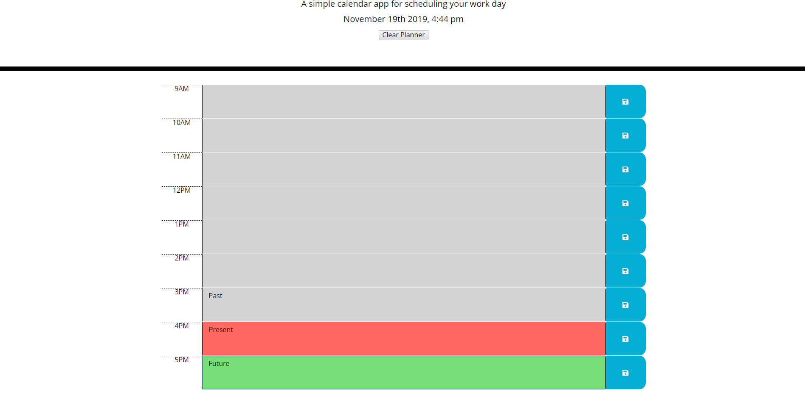

# Day-Planner
Deployed day planner application that allows users to save tasks from 9am-5pm, to better help organize and structure their days.

# Screenshot of Application

# Built With
* HTML
* CSS
* jQuery
* Javascript
* Bootstrap
* momentjs

# Functionality
The application allows users to input "tasks" or text into the text areas, save it locally, so that it will remain when the page is refreshed, and also color codes the hour blocks to indicate if the task is in the past(grey), currently happening(red), or in the future(green). It displays the current day and hour at the top of the page, and checks the hour blocks against current time to determine their color. I also added a clear planner button to allow the user to start over fresh whenever they need to.

# Author
Cassidy Fortner
